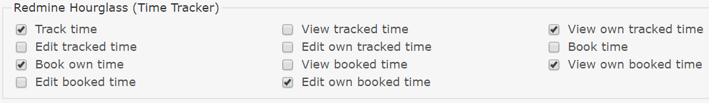
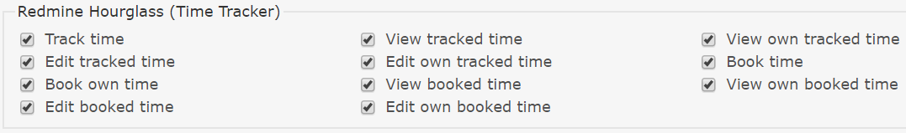
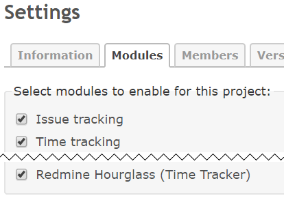
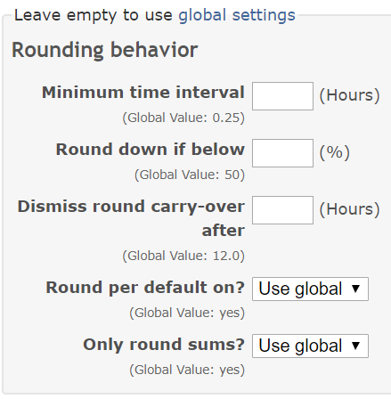

# Redmine Hourglass Plugin
[](https://codeclimate.com/github/hicknhack-software/redmine_hourglass)
[](https://travis-ci.org/hicknhack-software/redmine_hourglass)
[](https://gitter.im/hicknhack-software/redmine_hourglass?utm_source=badge&utm_medium=badge&utm_campaign=pr-badge&utm_content=badge)
 
Hourglass is a Redmine plugin to aid in tracking spent time on projects and issues. It allows users to start / stop a timer with an optional reference to what they are working on.
  
It allows various queries for time entries as well as possibilities to update existing entries.
  
Hourglass can be configured on a global base as well as per project.

See [CHANGELOG.md](CHANGELOG.md) for the latest features.


## Migrate from old Time Tracker plugin

_Note: This is a complete rewrite of the [Redmine Time Tracker Plugin](https://github.com/hicknhack-software/redmine_time_tracker). While it has feature parity (atleast we hope we didn't forget anything), the code base has changed positively, so further additions are no longer a pain to do._

___To ease migrating we added a function to import time entries from the redmine_time_tracker. You can find this in the plugin settings and as a rake task. For more information about migrating from the old time tracker take a look on the [Migration Guide](https://github.com/hicknhack-software/redmine_hourglass/wiki/Migration-Guide)___


## Companion App

We made an app to ease use of the time tracker on mobile (android only for now), check it out:

- [Hourglass for Android](https://play.google.com/store/apps/details?id=hnh.software.hourglass)

The Binaries are made available as downloads in the [Releases](https://github.com/hicknhack-software/redmine_hourglass/releases) section


## Features

- Per user time tracking
- Integrates well with Redmine by reusing time entries
- Overview of spent time for users
- Track project unrelated time
- Book tracked time on issues
- Detailed statistics for team management
- Status monitor of currently running trackers
- Detailed list views with Redmine queries integrated
- Report generation for projects with graphical time representation with customizable company logo
- Project specific settings


## Requirements

* Ruby 2.0.0 - 2.3.x
* Redmine 3.2.0 - 4.0.x
* An [ExecJS](https://github.com/sstephenson/execjs) compatible runtime, the gemfile includes [therubyracer](https://github.com/cowboyd/therubyracer) for unix based systems and windows ships with a default js interpreter (from Win 7 upwards), so most people should be set. If you happen to have problems like for example [#29](https://github.com/hicknhack-software/redmine_hourglass/issues/29), take a look on the linked ExecJS and install one of the mentioned runtimes.

See [.travis.yml](.travis.yml) for details about supported versions.
If a newer version doesn't appear in there, feel free to open an issue and report your experience with that Redmine or Ruby version.


## Installation

1. Place the source code of this plugin at the `plugins/redmine_hourglass` folder. 
   Either by:
    - Download a release from [Releases](https://github.com/hicknhack-software/redmine_hourglass/releases) and extract it into your Redmine.
    - Or clone the repository:
        ```bash
        git clone https://github.com/hicknhack-software/redmine_hourglass.git plugins/redmine_hourglass
        ```  
1. Install required Gems by:
    ```bash
    bundle install
    ```
1. Update the database schema by running the following command from the root of Redmine:
    ```bash
    bundle exec rake redmine:plugins:migrate RAILS_ENV=production
    ```
1. Precompile the assets.
    - If your Redmine is accessed with a path on your domain, like `www.example.com/redmine` use this option:
        ```bash
        bundle exec rake redmine:plugins:assets RAILS_ENV=production RAILS_RELATIVE_URL_ROOT=/redmine
        ```
    - If your Redmine is on the root you might simply run:
        ```bash
        bundle exec rake redmine:plugins:assets RAILS_ENV=production
        ```
1. (Re)start your Redmine
1. Done. *Please read the "First time usage" section below.*


## Update

The process is roughly the same as installing. Make sure you have the desired version in the `plugins` directory and run the steps above (except 1).

If you had it installed via git before, the first step is simply doing `git pull` in the `plugins/redmine_hourglass` directory.


## First time usage

1. Login as an administrator and setup the permissions for your roles
    - developers should have the rights to track time
    
      
      
    - managers should have the rights to fix times
    
      
    
1. Enable the "Hourglass" module for your project
    - works well in combination with the built in `Time tracking`
     
      
      
1. You should now see the Time Tracking link in the top menu.
                    
To track time directly on an issue, you can use the context menu (right click in the issues list) in
the issue list to start or stop the timer or press the "Start Tracking" button on the top right, next to the default "Book Time" Redmine button.


### What's what?

The plugin is intended to help us create invoices for customers. This requires the separation of time that was spent and time that is booked. Only booked times can be billed.
More information are available in the [wiki](http://github.com/hicknhack-software/redmine_hourglass/wiki).

#### Time Tracker

The stop watch. Time you spent gets "generated" by the trackers.

#### Time Log

A time log is a spent amount of time. If you stop the tracker, a time log is created. A time log has nothing attached to it. To add this time to issues or projects, you **book** time.
Role permissions can be edited to disable logging. This might be useful for reviewers, that do not generate time on their own but want to look up statistics on a project or user.

#### Time Booking

A booking is time that is actually connected to a task (project or issue). To create a booking, you book time from a time log. You are not limited to spent the whole time of a single booking, you can divide as you wish. You however aren't able book more time than what was actually logged. The role you have on projects and their settings determine if you are able to edit bookings or are just allowed to create them.

#### Settings

The plugin offers a list of settings at the Redmine roles and permission settings page. Also you can set the size and file for a logo to be displayed at the report in the Redmine plugin settings, enable rounding behaviour and interval as well as snapping percentage. You can also refine this settings per project if you have different accounting rules per project.




## Contributing

Bug reports and pull requests are welcome on [GitHub](https://github.com/hicknhack-software/redmine_hourglass). Please check the [contribution guide](CONTRIBUTING.md).This project is intended to be a safe, welcoming space for collaboration, and contributors are expected to our [code of conduct](CODE_OF_CONDUCT.md).


## License

The plugin is available released under the terms of [GPL](https://www.gnu.org/licenses/gpl).
